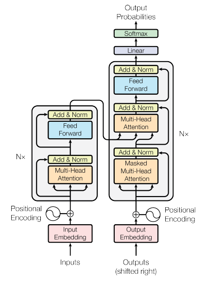
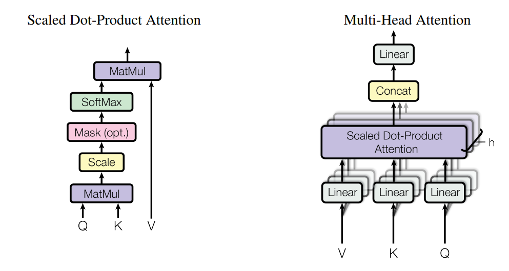
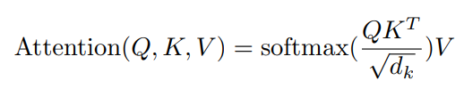

## Posology Text Binary Classification Using classification model based on transformers

## Notes

Clone the project on your machine with :

```
git clone https://github.com/zakariamejdoul/ml_tech_test.git
```

### Run model with Docker

To run the project model on your machine using train and api Makefiles :

```
make train
make api
```

### Run model on local environment :

The `requirements.txt` file should list all Python libraries that our model depends on, and they will be installed using:

```
pip install -r requirements.txt
```

To launch the classification model training task use command :

```
python .\text_classification_with_transformer.py
```

You can also run model training using `text_classification_with_transformer.ipynb` file and Jupyter Server.

And to expose the classification model using Flask microservice, use command :

```
python api.py
```
Then, a Flask api will be exposed on port 4002.<br>

Once the microservice is started, you can request the model to predict a query and receive prediction response of your text query, it would be done using the following command :

```
curl -G "http://localhost:4002/posology" --data-urlencode "query=1 comprimé matin midi et soir" | jq
```

You will get the following json response format :

```
{
    "query": "1 comprimé matin midi et soir",
    "is_posology": true
}
```

## Behaviour

Text classification, including supervised text classification, semi-supervised text classification, and unsupervised text classification, is a major research field in Natural language processing (NLP).<br>

In this project, we focus on the supervised learning area; that is, we train the model on labeled data and test it using unlabeled data. Text classification has three main fields: sentiment analysis, question type classification and topic type labeling. Text classification can be applied in many real applications such as spam classification, news grouping, intelligent recommendation.<br>

Under the ML approach, the Recurrent Neural Network (RNN) specifically, the Long short-term memory (LSTM), is a state-of-the-art structure. The LSTM uses its special structure to extract sequential features and reserve them. Afterwards, another special neural network, the Convolutional Neural Network(CNN) can extract further sentence features and perform classification.

Text classification can be described as a machine learning technique to classify the type of text into a particular category. These categories depend on the type of task they perform. Some examples include sentiment analysis, topic labeling, spam detection, and intent detection.<br>

Most of the data that is available in the natural world is unstructured. Hence, it becomes crucial to find a way to reliably manage these datasets while formulating a desirable structure to analyze these problems. In this article, we will explore the concept of transformers to solve the task of text classification. Let us get started by understanding the transformer architecture.<br>

The transformers architecture published in the research paper titled ["Attention Is All You Need"](https://arxiv.org/pdf/1706.03762.pdf) is one of the most influential papers in deep learning and natural language processing.

## What is Transformers ?

> In this work we propose the Transformer, a model architecture eschewing recurrence and instead relying entirely on an attention mechanism to draw global dependencies between input and output. The Transformer allows for significantly more parallelization … the Transformer is the first transduction model relying entirely on self-attention to compute representations of its input and output without using sequence-aligned RNNs or convolution.
<br><br>“Attention is all you need” paper [1]



The Transformer model extract features for each word using a self-attention mechanism to figure out how important all the other words in the sentence are w.r.t. to the aforementioned word. And no recurrent units are used to obtain this features, they are just weighted sums and activations, so they can be very parallelizable and efficient.
 It consists of the encoder architecture with the positional encodings, inputs, input embeddings, and a block containing some neural network components. We will refer to this block as the transformer block, and it will be an integral aspect of understanding the working procedure of transformers.

The arrows represent the direct and skip connections that are to be made in the transformer architecture. The multi-head attention module will receive three inputs, namely values, keys and queries. The next three blocks are quite simple as we perform an addition and normalization operation, pass it through a feed-forward network, and reform the addition and normalization operation.



The embedding input in the form of vectors, keys, and queries is passed through a linear layer. Let us say the embedding has a dimensionality of 64, and we are making use of four splits for each layer. Then, each of the layers passed through will have four blocks of 16-Dimensional data embedded in them.

This data is passed through the scaled dot-product attention, which utilizes a model similar to the one mentioned in the above figure. Also, the formula below represents the clear performance of the model, where the dot attention is equal to the product of the Softmax of the product of queries, Transpose of keys, divided by the scaling factor (which in this case is the square root of embedding size), and the vectors. Finally, the results are concatenated to retrieve the same size as the embedding, and then it is passed through a linear layer.



Finally, the right-hand side of the transformer network consists of the decoder architecture.<br>
They have a couple of transformer blocks, one with masked multi-head attention to ensure that each consecutive output only has knowledge of the previous input and not any other excessive information. The Nx in the figure represents the notion that there can be several stacks of encoder or decoder blocks to compute a particular task.

## References

[1] [Attention Is All You Need, 2017](https://arxiv.org/pdf/1706.03762.pdf) <br>
[2] [Transformers For Text Classification](https://blog.paperspace.com/transformers-text-classification/#understanding-the-transformer-architecture) <br>
[3] [Attention is all you need: Discovering the Transformer paper](https://towardsdatascience.com/attention-is-all-you-need-discovering-the-transformer-paper-73e5ff5e0634) <br>
[4] [TRANSFORMERS FROM SCRATCH](http://peterbloem.nl/blog/transformers)

## Author
_Zakaria Mejdoul_

